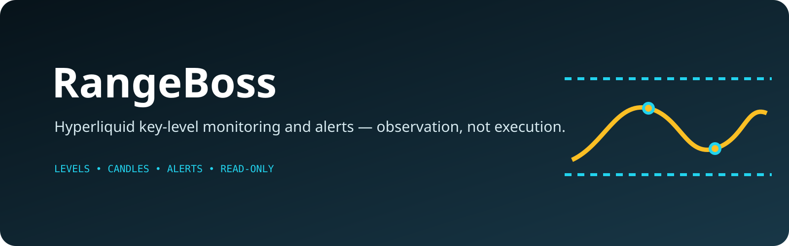

<p align="center">
  
</p>

# Hyperliquid Level Monitor

A self-hosted monitor for **Hyperliquid perpetuals** that automatically marks the key price levels on a chart, watches live 15-minute candles, and alerts you the moment price touches a level — via Telegram and a read-only web dashboard.

It is a **monitoring and alerting tool, not a trading bot.** It places no orders, holds no account keys, and never executes. It tells you when something worth looking at happens and shows you a chart so you can verify it yourself.

---

## What it does

- **Auto-marks four levels** per coin, recomputed each UTC day from the daily candle series:
  - **Range High / Range Low** — the prior completed day's high and low.
  - **Swing High / Swing Low** — the nearest pivot (fractal) high above the range high and pivot low below the range low, scanning back through all available history.
- **Watches live 15m candles** over a Hyperliquid WebSocket and runs detection only on *closed* candles (never the still-forming one).
- **Touch & break detection** — fires a `LEVEL_TOUCH` when price tags a level and rejects, a `LEVEL_BREAK` when a level gives way. Duplicate touches on the same level are suppressed within a cooldown window.
- **Confirmed-reversion signals** (informational only) — a three-candle confirmation sequence that produces a suggested direction, entry, stop, target, and a 0–100 confluence score. Surfaced, never traded.
- **Telegram alerts** — a message lands within one closed candle of price touching a level.
- **Web dashboard** — a candlestick chart with the four level lines drawn as labelled horizontal lines, event markers, and a live signal feed. This is your verification tool: it makes it obvious at a glance whether the auto-marked levels sit where they should.
- **Multi-coin** — monitors a configurable list of perps at once (e.g. `BTC, ETH, SOL, HYPE, …`), including HIP-3 builder-deployed markets via the `dex:ASSET` form (e.g. `xyz:SP500`).
- **Local SQLite cache** — candles, levels, and events are stored on disk, so the dashboard loads instantly and the engine can recompute without re-hitting the API.

---

## Architecture

Two processes that share only a SQLite file:

```
Hyperliquid API ──WS live candles──▶  Bun monitor service
                ──REST history────▶   - computes levels
                                       - detects touches / signals
                                       - writes to SQLite
                                       - sends Telegram alerts
                                       - serves a JSON API (HTTP)
                                               │
                                          SQLite file
                                               │
                                       Next.js dashboard (reads the JSON API)
                                       - candlestick chart + level lines
                                       - signal feed
```

The **monitor** is the brain and runs 24/7. The **dashboard** is a read-only window onto it.

The strategy logic lives in `packages/core` and is **pure** — no network, no I/O. It takes candles in and returns plain objects, which keeps it unit-tested and reusable.

```
packages/
├── core/        # pure strategy logic (levels, detection, scoring) + tests
├── monitor/     # Bun service: Hyperliquid client, SQLite store, HTTP API, Telegram
└── web/         # Next.js + Tailwind + lightweight-charts dashboard
config.ts        # single source of configuration
data/            # SQLite database (gitignored)
```

---

## Tech stack

| Layer | Choice |
|---|---|
| Language | TypeScript end to end |
| Monitor runtime | [Bun](https://bun.sh) (WebSocket + detection + storage + HTTP API) |
| Storage | SQLite via `bun:sqlite` |
| Frontend | Next.js + Tailwind CSS |
| Charting | [lightweight-charts](https://github.com/tradingview/lightweight-charts) (TradingView, MIT) |
| Notifications | Telegram Bot API |
| Market data | Hyperliquid public REST + WebSocket |

---

## Getting started

### Prerequisites

- [Bun](https://bun.sh) installed.

### Install

```bash
bun install
```

### Run the monitor (the brain)

```bash
bun run monitor
```

It backfills recent candle history, prints each coin's four levels, opens the WebSocket, and starts the JSON API on `http://localhost:8787`.

### Run the dashboard

In a second terminal:

```bash
bun run web
```

Open `http://localhost:3000`.

### Run the tests

```bash
bun test            # core strategy unit tests
bun run check       # tests + TypeScript type-check
```

---

## Configuration

All configuration lives in [`config.ts`](config.ts). Key options:

| Option | Default | Meaning |
|---|---|---|
| `coins` | `BTC, ETH, SOL, …` | Perps to monitor. Override with the `COINS` env var, e.g. `COINS="ETH,SOL,xyz:SP500"`. |
| `candleInterval` | `15m` | The detection interval. |
| `swingLookbackDays` | `0` | `0` = scan all available history for swing levels (no cap). |
| `pivotWindow` | `2` | Fractal pivot window for swing detection. |
| `touchTolerance` | `0.0008` | How close (0.08%) counts as a touch. |
| `touchCooldownMinutes` | `60` | Suppress duplicate touch alerts within this window. |
| `confirmWithinCandles` | `3` | Candles allowed for a reversion sequence to confirm. |
| `staleSocketSeconds` | `90` | Force a WebSocket reconnect after this much silence. |
| `apiPort` | `8787` | Monitor JSON API port. |
| `dbPath` | `data/monitor.db` | SQLite file location. |

### Telegram alerts (optional)

Set these as environment variables before starting the monitor:

```bash
export TG_BOT_TOKEN="your-bot-token"
export TG_CHAT_ID="your-chat-id"
```

Leave them unset to run dashboard-only with no Telegram delivery.

---

## API endpoints

The monitor serves read-only JSON on `config.apiPort` (default `8787`):

| Endpoint | Returns |
|---|---|
| `GET /api/coins` | List of monitored coins. |
| `GET /api/levels?coin=…` | Today's four levels for a coin. |
| `GET /api/candles?coin=…&limit=…` | Recent candles for the chart. |
| `GET /api/events?coin=…&limit=…` | Recent touches, breaks, and signals (newest first). |
| `GET /api/status?coin=…` | Coin, last candle time, socket health, current price. |

---

## Scope

**In scope:** auto level marking, live monitoring, touch/break detection, informational reversion signals, a verification dashboard, and Telegram alerts across multiple perps.

**Out of scope:** order placement and any authenticated/trading endpoints, spot markets, and backtesting. The core engine is built pure so backtesting *could* be added later, but it isn't built today.

---

## Disclaimer

This software is for informational and educational purposes only. It is not financial advice and it does not place trades. Markets are risky; verify everything yourself before acting on any signal. Use at your own risk.
